# Power BI AdventureWorks Dashboard

## 📊 Description du projet

Ce projet consiste à créer un tableau de bord interactif dans **Power BI**, basé sur les données de l'entreprise fictive **AdventureWorks**. Les données sont extraites de l'exemple AdventureWorks fourni par Microsoft, que vous pouvez consulter [ici](https://learn.microsoft.com/en-us/sql/samples/adventureworks-install-configure?view=azuresqldb-current&tabs=ssms).

L'objectif est de fournir des insights sur les ventes, les produits, les territoires et les retours, en exploitant les fonctionnalités avancées de Power BI.

---

## 📁 Structure du projet

```plaintext
AdventureWorks-PowerBI/
├── asset/
├── data/
│   ├── Sales
│       ├── AdventureWorks_Sales_2015.csv
│       ├── AdventureWorks_Sales_2016.csv
│       ├── AdventureWorks_Sales_2017.csv
|   ├── AdventureWorks_Customers.csv
│   ├── AdventureWorks_Product_Categories.csv
│   ├── AdventureWorks_Product_Subcategories.csv
│   ├── AdventureWorks_Products.csv
│   ├── AdventureWorks_Returns.csv
│   └── AdventureWorks_Territories.csv
├── image/
└── AdventureWorks_App.pbix
```

## 🔄 Présentation de l'architecture de la solution
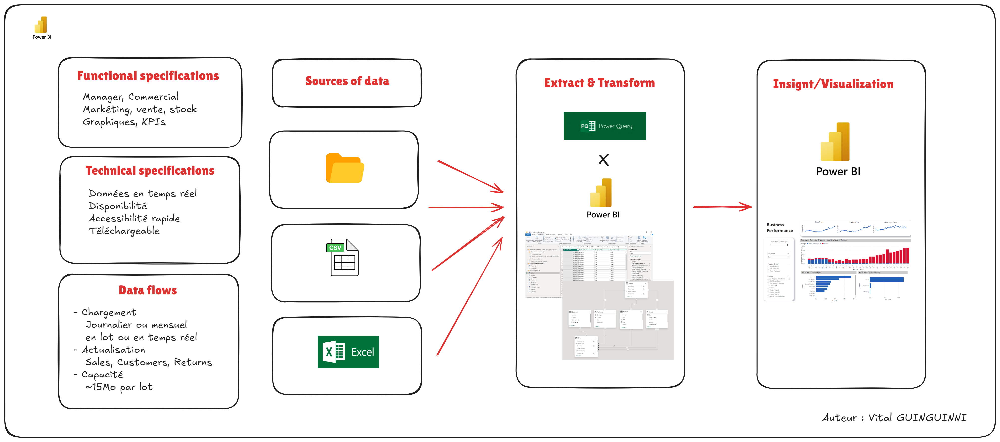

---

## 🌟 Présentation des pages

### Page 1 : Business Performance
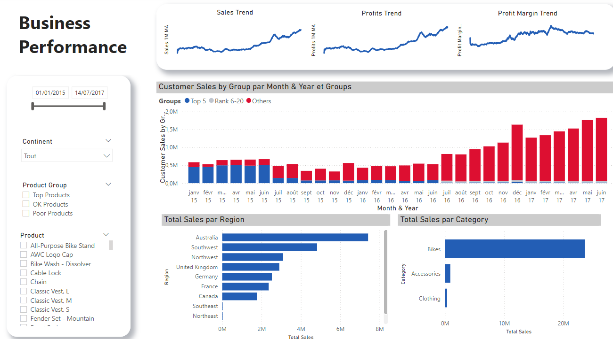

### Page 2 : Customer Order
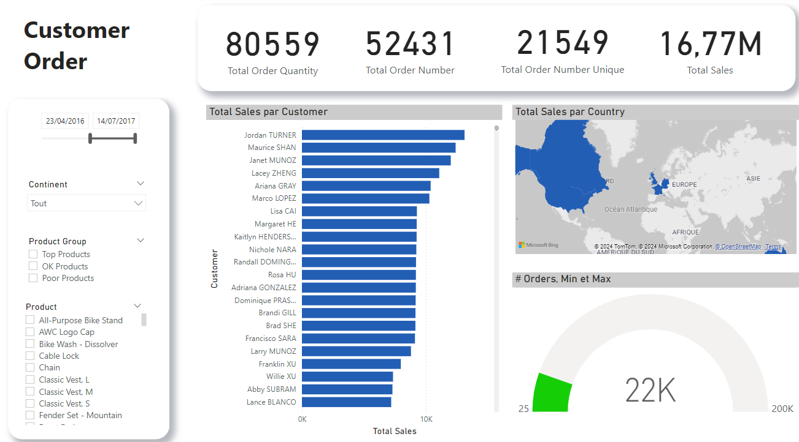

---

## 📊 Présentation des graphiques

### Profits et Ventes
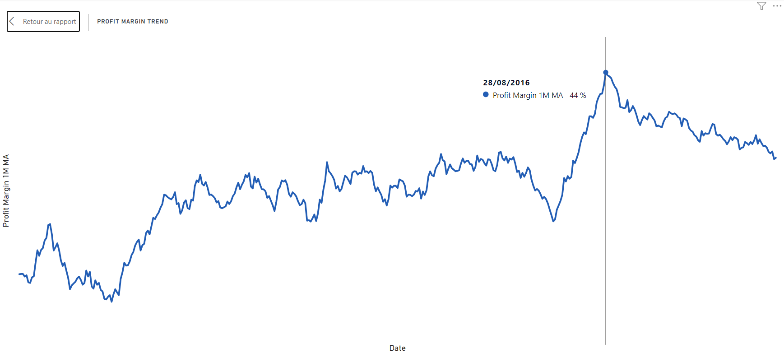
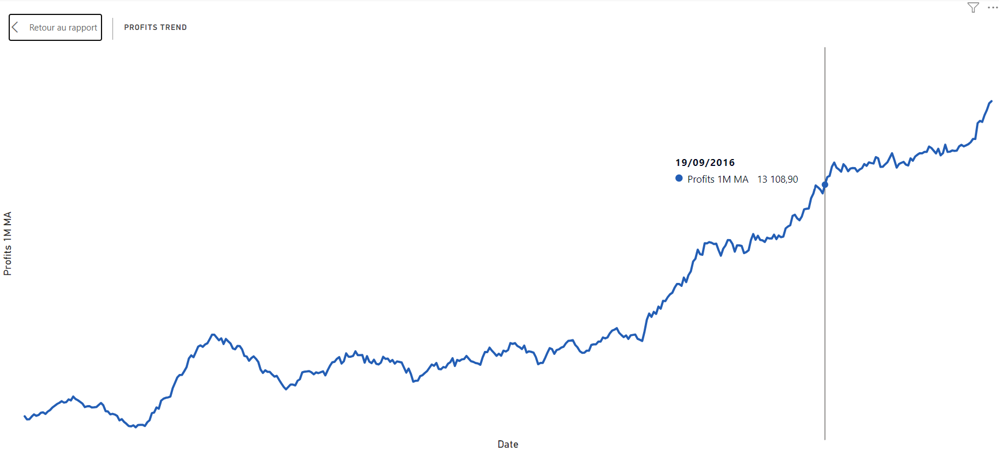
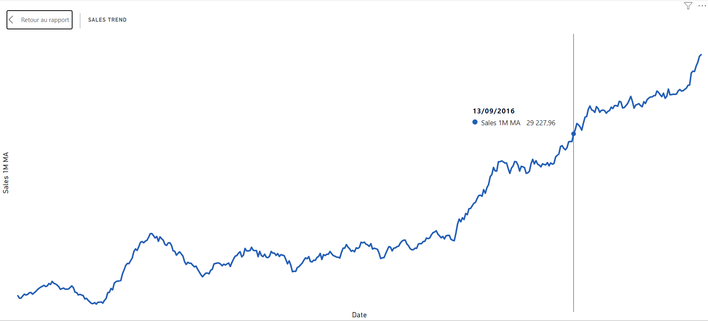
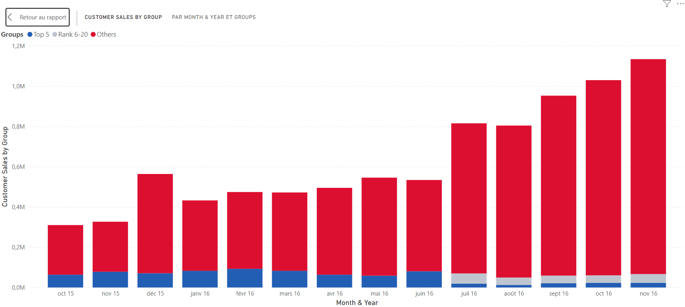

### Répartition Géographique et Catégories
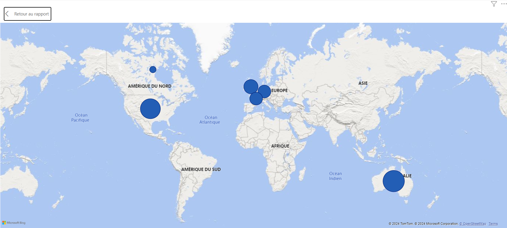
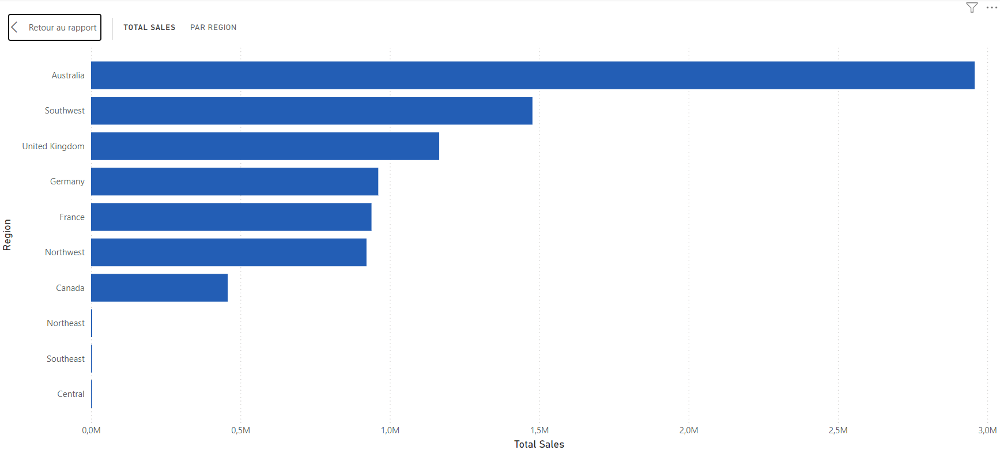
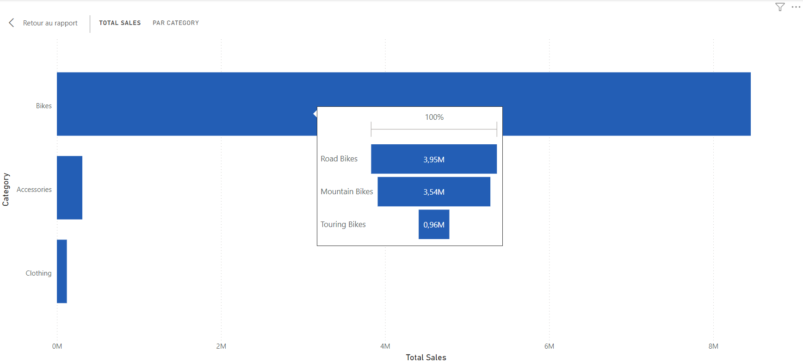

---

## 🔗 Modèle de données
Voici le modèle relationnel utilisé dans Power BI :

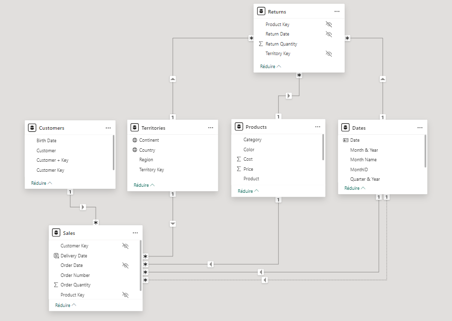

---

## 🚀 Objectifs

1. **Créer un tableau de bord interactif** :
   - Analyse des ventes par produit, catégorie et sous-catégorie.
   - Suivi des performances par territoire.
   - Étude des retours et identification des produits problématiques.

2. **Mettre en place une modélisation des données efficace** dans Power BI :
   - Connexion et relation entre les différentes tables.
   - Utilisation du modèle M pour des mesures et colonnes calculées.

3. **Améliorer la prise de décision** à l'aide de visualisations dynamiques et de rapports clairs.

---

## 🛠️ Prérequis

- **Logiciel** : [Microsoft Power BI Desktop](https://powerbi.microsoft.com/)
- **Données** : Inclues dans ce dépôt sous forme de fichiers CSV.
- **Connaissances** :
  - Notions de base en BI et Power BI.
  - Manipulation et transformation de donnée dans Power Query et DAX
---

## 📈 Résultats attendus

Le tableau de bord final contiendra :
- Un aperçu des **ventes totales** et de la répartition des revenus.
- Une visualisation des **meilleures catégories et produits**.
- Une analyse des **territoires les plus performants**.
- Une vue des **taux de retour** et des produits concernés.

---

## 🔗 Références

- **AdventureWorks Data Source** : [AdventureWorks Sample Data by Microsoft](https://learn.microsoft.com/en-us/sql/samples/adventureworks-install-configure?view=azuresqldb-current&tabs=ssms)
- **Documentation Power BI** : [Power BI Guide](https://powerbi.microsoft.com/en-us/documentation/)

---

## 📌 Utilisation

1. Clonez ce dépôt :
   ```bash
   git clone https://github.com/votreutilisateur/AdventureWorks-PowerBI.git
   ```
2. Explorez les dossiers pour comprendre la structure et importer les fichiers nécessaires.
3. Ouvrez le fichier `AdventureWorks_App.pbix` dans Power BI Desktop pour accéder au tableau de bord.
4. Pour toute réutilisation modifier le dossier de tratrail dans l'éditeur Power Query > Gérer les paramètres

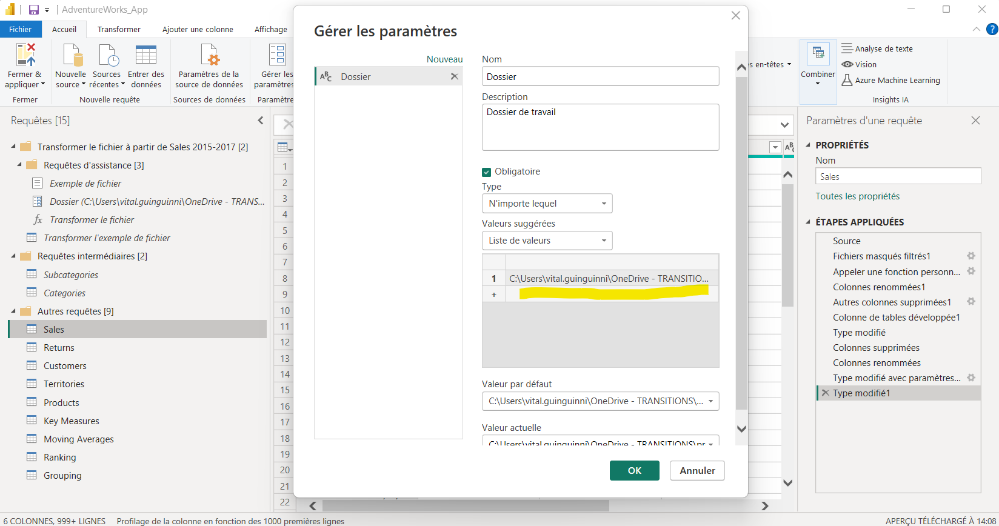

---

## 🎉 Merci de votre intérêt !

N'hésitez pas à contribuer en me proposant des améliorations ou des idées de visualisations supplémentaires pouvant servir le métier !
